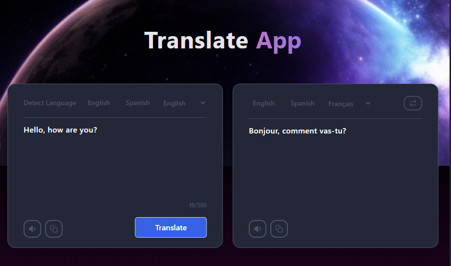
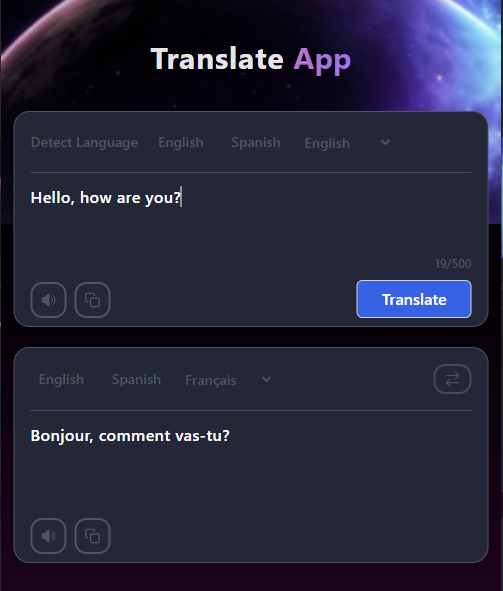

## Simple Web Translator using MyMemory API.

A lightweight, easy-to-use translation web application that translates text between languages using the free **MyMemory Translated API**.

> Desktop demo 👇



> Mobile demo👇



## ✨ Features

- Translate text between **any two languages** supported by MyMemory
- Supports **new lines** (multi-line text translation)
- Clean and minimal user interface
- Shows clear error messages (especially for daily quota)
- JSON response support for easier parsing
- No backend needed – pure frontend + API calls

## 🛠️ Tech Stack

- Framework: React

- Language: TypeScript

- Styling: Tailwind CSS

- Translation API: MyMemory API

## 📦 Installation

1. Clone the repository:

```bash
git clone https://github.com/01mehran/translate-app.git
cd translate-app
```

2. Install dependencies:

```bash

npm install
```

3. Run the development server:

```bash
npm run dev
```

## 🤝 Contributing

1. Contributions are welcome! Please feel free to submit a Pull Request.

2. Fork the project

3. Create your feature branch (git checkout -b feature/AmazingFeature)

4. Commit your changes (git commit -m 'Add some AmazingFeature')

5. Push to the branch (git push origin feature/AmazingFeature)

6. Open a Pull Request

## 📧 Contact

mehran mohamadi - mehranmohamadi1311@gmail.com

Project Link: https://github.com/01mehran/translate-app.git
